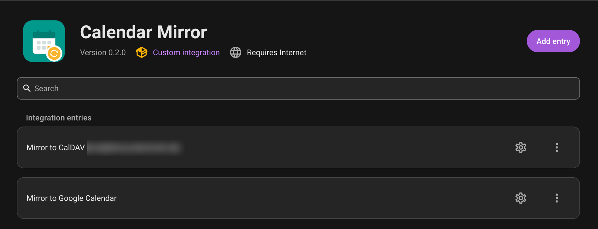

# Calendar Mirror

A Home Assistant custom integration that pushes local HA calendar
entities into an external calendar — **Google Calendar** or a generic
**CalDAV** server (Nextcloud, mailbox.org, Radicale, etc.) — actively
creating and deleting events there, not a passive, read-only ICS
export. Sync is **one-directional**: Home Assistant is always the
source of truth, and the target calendar is never read back into HA.

## Installation

Not yet available in the default HACS store. Add it as a custom
repository:

1. In HACS: **Integrations → ⋮ → Custom repositories**.
2. Add this repository's URL with category **Integration**.
3. Install **Calendar Mirror**, restart Home Assistant, then
   **Settings → Devices & Services → Add Integration → Calendar
   Mirror** and pick a target type (see [Configuration](#configuration)
   below).

Or install manually by copying `custom_components/calendar_mirror`
into your Home Assistant `config/custom_components/` directory and
restarting.

## What it does

- Reads events from one or more existing `calendar.*` entities in Home
  Assistant (local calendars, CalDAV, other integrations' calendars,
  etc.) and pushes them into a Google Calendar or CalDAV calendar of
  your choice.
- Runs a full sync pass on a recurring interval: every event it
  previously created is deleted, then a fresh copy is created from the
  current source data. There's no in-place update, and events it
  didn't create are left alone.
- **The target calendar isn't safe to edit by hand** — any manual
  change there, including deleting a synced event, is undone on the
  next sync pass. Nothing is ever written back to HA. Synced events
  get a 🔒 in the title and a note in the description as a visible
  reminder, since neither service offers a real per-event read-only
  flag.
- Google Calendar authenticates via Home Assistant's standard OAuth2
  `application_credentials` flow, same as the official Google Calendar
  integration. CalDAV authenticates with a URL, username, and
  password, tested against the server before the entry is created.
- Source and target calendars can be changed later via the
  integration's **Configure** option, without repeating sign-in.

## Configuration

**Settings → Devices & Services → Add Integration → Calendar Mirror**,
then choose a target type:

- **Google Calendar**: create a Google Cloud OAuth client (**Web
  application** type) authorized to redirect to
  `https://my.home-assistant.io/redirect/oauth`, enable the Calendar
  API, add it under **Application Credentials** in HA, then sign in
  and pick your source calendars and target calendar from a dropdown.
- **CalDAV**: enter your server's URL, username, and password (an
  app-specific one if your server supports it), then pick your source
  calendars and target calendar from a dropdown fetched from your
  account.

If a Google grant expires or a CalDAV password changes, Home Assistant
prompts you to reauthenticate.

## How it compares to existing options

| | Direction | Update latency |
|---|---|---|
| [Calendar Merge](https://community.home-assistant.io/t/calendar-merge-combine-multiple-calendar-entities-into-one-hacs/994159), [Aurora Calendar](https://community.home-assistant.io/t/aurora-calendar-family-calendar-integration-and-card/1009402) | Internal only | — combine calendars for display inside HA, don't push anywhere external |
| [ha-icalendar](https://github.com/codyc1515/ha-icalendar) | Pull (read-only) | Up to the subscribing app — Google/Apple Calendar both throttle subscribed ICS feeds to roughly every 12–24 hours |
| **Calendar Mirror** | Push, one-way (HA → target) | HA's own sync interval — actively creates/deletes events, nothing read back |

This gap exists because HA core's `calendar.create_event` service has
no generic counterpart for deleting events, so a naive one-way sync
built from that service alone can create entries but never clean them
up.

## Requirements

- For Google Calendar: a Google Cloud project with the Calendar API
  enabled and an OAuth client.
- For CalDAV: a server URL and an account with write access to the
  target calendar.
- One or more `calendar.*` entities already available in Home
  Assistant to use as sources.

## Design notes

Background on why this integration exists, prior-art research, and
architecture decisions live in [`docs/notebook.md`](docs/notebook.md).

## Contributing

See [`CONTRIBUTING.md`](CONTRIBUTING.md) for code style and commit
conventions. Contributions and testing against other source calendar
types are welcome.

## License

MIT — see [LICENSE](LICENSE).
